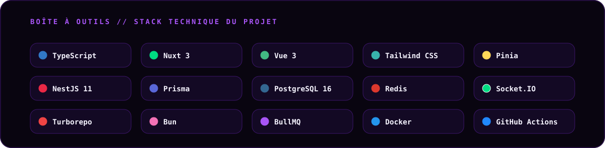
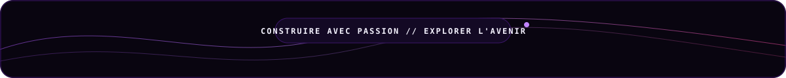

<picture>
  <source media="(prefers-color-scheme: dark)" srcset="./assets/generated/banner-dark.svg">
  <source media="(prefers-color-scheme: light)" srcset="./assets/generated/banner-light.svg">
  
</picture>

<p align="center">
  <a href="https://github.com/kyriss-69?tab=followers"></a>
  <a href="https://discord.com"></a>
  <a href="mailto:contact.evolysdigital@gmail.com"></a>
</p>

<p align="center">
  Je conçois des applications web modernes et j’explore le potentiel des agents et de l’IA —<br>
  alliant rigueur de code, interfaces fluides et curiosité sans limite.
</p>

## Signal actuel

<table>
  <tr>
    <td width="33%" valign="top">
      <h3>🌐 Applications Web</h3>
      Conception d'interfaces dynamiques, modernes et réactives propulsées par l'écosystème <b>React</b>, <b>Next.js</b> et <b>TypeScript</b>.
    </td>
    <td width="33%" valign="top">
      <h3>🤖 Projets & Agents IA</h3>
      Exploration active des modèles d'IA, automatisation intelligente, prompt engineering et intégration d'agents autonomes.
    </td>
    <td width="33%" valign="top">
      <h3>🎯 Nouveaux défis & Projets</h3>
      En apprentissage actif continu, soif d'apprendre chaque jour et ouvert aux collaborations stimulantes et opportunités professionnelles.
    </td>
  </tr>
</table>

## Boîte à outils

<picture>
  <source media="(prefers-color-scheme: dark)" srcset="./assets/generated/stack-dark.svg">
  <source media="(prefers-color-scheme: light)" srcset="./assets/generated/stack-light.svg">
  
</picture>

## Pouls GitHub

<picture>
  <source media="(prefers-color-scheme: dark)" srcset="./assets/generated/metrics-dark.svg">
  <source media="(prefers-color-scheme: light)" srcset="./assets/generated/metrics-light.svg">
  
</picture>

<sub>Les données publiques sont actualisées automatiquement. Aucun nom de dépôt privé ni détail d’activité privée n’est exposé.</sub>

## Projets choisis

<table>
  <tr>
    <td width="50%" valign="top">
      <h3>🌐 <a href="https://github.com/kyriss-69">Portfolio Interactif</a></h3>
      Un univers personnel moderne conçu pour exposer mes réalisations, mes stacks et mon parcours avec des animations fluides.<br><br>
      <code>Next.js</code> <code>TypeScript</code> <code>Tailwind CSS</code>
    </td>
    <td width="50%" valign="top">
      <h3>🤖 <a href="https://github.com/kyriss-69">AI Assistant & Agent</a></h3>
      Outil d'assistance intelligent explorant l'orchestration de modèles de langage (LLM) et le raisonnement contextuel.<br><br>
      <code>agents IA</code> <code>LLM</code> <code>TypeScript</code> <code>Node.js</code>
    </td>
  </tr>
  <tr>
    <td width="50%" valign="top">
      <h3>⚡ <a href="https://github.com/kyriss-69">Fullstack Web App</a></h3>
      Application web complète avec tableau de bord réactif, gestion d'utilisateurs et architecture de données robuste.<br><br>
      <code>React</code> <code>Node.js</code> <code>Fullstack</code> <code>PostgreSQL</code>
    </td>
    <td width="50%" valign="top">
      <h3>🛠️ <a href="https://github.com/kyriss-69">API REST & Microservices</a></h3>
      Architecture de services backend sécurisés et modulaires, testés et conteneurisés avec Docker.<br><br>
      <code>Node.js</code> <code>Express</code> <code>Docker</code> <code>REST API</code>
    </td>
  </tr>
</table>

> [!NOTE]
> Plusieurs projets sont en cours de consolidation ou en développement actif. Leurs cartes sont déjà en place pour préparer leur ouverture publique.

## Activité & Contributions

<div align="center">
  <picture>
    <source media="(prefers-color-scheme: dark)" srcset="https://raw.githubusercontent.com/kyriss-69/kyriss-69/output/github-contribution-grid-snake-dark.svg">
    <source media="(prefers-color-scheme: light)" srcset="https://raw.githubusercontent.com/kyriss-69/kyriss-69/output/github-contribution-grid-snake.svg">
    
  </picture>
</div>

## Principes de fonctionnement

```text
code propre  ·  apprentissage continu  ·  curiosité technologique
solutions modernes  ·  rigueur & autonomie  ·  passion du web & de l'IA
```

<p align="center">
  <a href="https://github.com/kyriss-69">GitHub</a> ·
  <a href="https://discord.com">Discord</a> ·
  <a href="mailto:contact.evolysdigital@gmail.com">Contact Direct</a>
</p>

<picture>
  <source media="(prefers-color-scheme: dark)" srcset="./assets/generated/footer-dark.svg">
  <source media="(prefers-color-scheme: light)" srcset="./assets/generated/footer-light.svg">
  
</picture>
