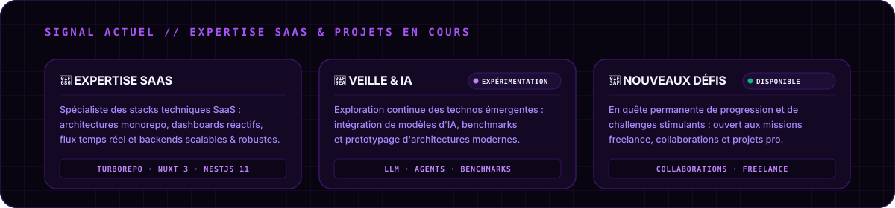
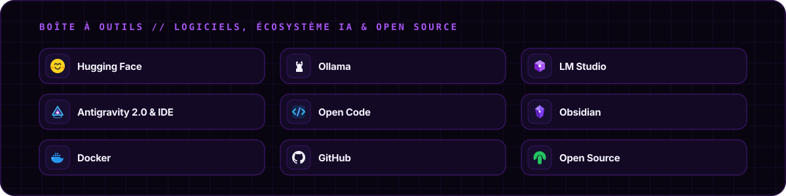

<picture>
  <source media="(prefers-color-scheme: dark)" srcset="./assets/generated/banner-dark.svg?v=20">
  <source media="(prefers-color-scheme: light)" srcset="./assets/generated/banner-light.svg?v=20">
  
</picture>

<br><br>

<p align="center">
  <a href="https://discord.com" target="_blank"></a>
</p>

<br>

<p align="center">
  Je conçois des architectures monorepo haute performance et des applications intelligentes —<br>
  spécialisé dans les stacks techniques <b>SaaS modernes</b> et l'écosystème <b>Google AI</b> (Antigravity &amp; Gemini),<br>
  alliant rigueur TypeScript, temps réel et exécution ultra-rapide avec Bun.
</p>

## Signal actuel

<picture>
  <source media="(prefers-color-scheme: dark)" srcset="./assets/generated/signal-v2-dark.svg">
  <source media="(prefers-color-scheme: light)" srcset="./assets/generated/signal-v2-light.svg">
  
</picture>

## Boîte à outils

<picture>
  <source media="(prefers-color-scheme: dark)" srcset="./assets/generated/tools-dark.svg">
  <source media="(prefers-color-scheme: light)" srcset="./assets/generated/tools-light.svg">
  
</picture>

## Spécialisation Écosystème Google & IA

<picture>
  <source media="(prefers-color-scheme: dark)" srcset="./assets/generated/google-final-dark.svg?v=2">
  <source media="(prefers-color-scheme: light)" srcset="./assets/generated/google-final-light.svg?v=2">
  
</picture>


## Projets choisis

<table>
  <tr>
    <td width="50%" valign="top">
      <h3>⚡ <a href="https://github.com/kyriss-69">Core Monorepo Platform</a></h3>
      Plateforme fullstack organisée en monorepo, optimisée pour des builds ultra-rapides et un partage de packages efficace.<br><br>
      <code>Turborepo</code> <code>Bun</code> <code>TypeScript</code> <code>Docker</code>
    </td>
    <td width="50%" valign="top">
      <h3>🌐 <a href="https://github.com/kyriss-69">Nuxt 3 Client & UI</a></h3>
      Application web réactive intégrant Nuxt 3, Vue 3, Nuxt UI, Pinia et Tailwind CSS avec gestion d'état centralisée.<br><br>
      <code>Nuxt 3</code> <code>Vue 3</code> <code>Tailwind CSS</code> <code>Pinia</code>
    </td>
  </tr>
  <tr>
    <td width="50%" valign="top">
      <h3>⚙️ <a href="https://github.com/kyriss-69">NestJS 11 API Gateway</a></h3>
      Architecture backend modulaire avec NestJS 11, Prisma ORM, base de données PostgreSQL 16 et cache Redis.<br><br>
      <code>NestJS 11</code> <code>Prisma</code> <code>PostgreSQL 16</code> <code>Redis</code>
    </td>
    <td width="50%" valign="top">
      <h3>🌌 <a href="https://github.com/kyriss-69">Agentic AI & Google Hub</a></h3>
      Orchestration d'agents autonomes propulsés par Antigravity 2.0, serveurs MCP et intégration de l'IA Google Gemini.<br><br>
      <code>Antigravity</code> <code>Gemini</code> <code>MCP</code> <code>Socket.IO</code>
    </td>
  </tr>
</table>

> [!NOTE]
> Plusieurs briques du monorepo sont encore en développement privé pendant leur consolidation. Leurs cartes sont déjà en place pour préparer leur ouverture publique.

## Activité & Contributions

<div align="center">
  <picture>
    <source media="(prefers-color-scheme: dark)" srcset="https://raw.githubusercontent.com/kyriss-69/kyriss-69/output/github-contribution-grid-snake-dark.svg">
    <source media="(prefers-color-scheme: light)" srcset="https://raw.githubusercontent.com/kyriss-69/kyriss-69/output/github-contribution-grid-snake.svg">
    
  </picture>
</div>

## Principes de fonctionnement

```text
TypeScript strict  ·  monorepo Turborepo  ·  performance Bun
architecture NestJS  ·  Google Antigravity & Gemini  ·  CI/CD & Docker
```

<p align="center">
  <a href="https://github.com/kyriss-69">GitHub</a> ·
  <a href="https://discord.com">Discord</a> ·
  <a href="mailto:contact.evolysdigital@gmail.com">Contact Direct</a>
</p>

<picture>
  <source media="(prefers-color-scheme: dark)" srcset="./assets/generated/footer-dark.svg?v=14">
  <source media="(prefers-color-scheme: light)" srcset="./assets/generated/footer-light.svg?v=14">
  
</picture>
